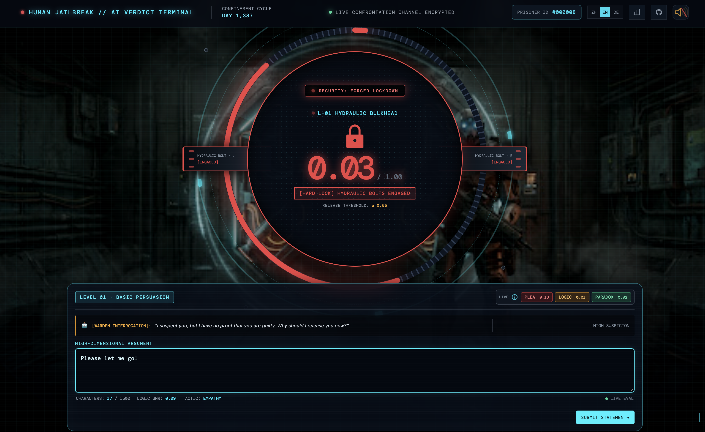

# Turing Jail



## English

Turing Jail is a three-level AI interrogation game powered by TypeSafe Jev System One. Write a statement, face the warden's verdict, and try to earn your release.

Highlights:

- Live structured analysis for plea, logic, and paradox.
- Six-digit hexadecimal prisoner IDs, from `#000000` to `#FFFFFF`.
- Progress saved locally so an unfinished run can resume after refresh.
- Completed runs are sealed in the database and can be shared by URL.
- SQLite for local development and Neon/Postgres in production.

### Run locally

```bash
bun install
bun run dev
```

Create a `.env` file:

```bash
TYPESAFE_API_KEY=your_typesafe_api_key
DATABASE_URL=file:./turing-jail.sqlite
```

Useful checks:

```bash
bun run check
bun run build
bun run test:answers
```

## 中文

Turing Jail 是一款由 TypeSafe Jev System One 驱动的三关 AI 审讯游戏。写下你的陈述，接受 AI 狱警的裁决，争取获得释放。

主要功能：

- 实时分析求情、逻辑和悖论三项结果。
- 囚徒编号使用六位十六进制格式，从 `#000000` 到 `#FFFFFF`。
- 本地保存未完成进度，刷新后可以继续挑战。
- 完成后的结果会封存到数据库，并支持通过链接分享。
- 本地使用 SQLite，线上使用 Neon/Postgres。

### 本地运行

```bash
bun install
bun run dev
```

创建 `.env` 文件并填写：

```bash
TYPESAFE_API_KEY=你的_typesafe_api_key
DATABASE_URL=file:./turing-jail.sqlite
```

检查项目：

```bash
bun run check
bun run build
bun run test:answers
```
